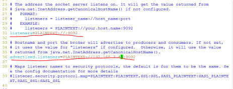

## 1. 调试Kafka异常
在连接不成功时需要查看异常日志，将log4j更改为: `DEBUG`,查看输出：
错误信息如下：
```
    2020-03-16 16:07:45,039 DEBUG [org.apache.kafka.clients.NetworkClient] - Error connecting to node user:9092 (id: 0 rack: null)
java.io.IOException: Can't resolve address: user:9092
	kafka.clients.consumer.internals.AbstractCoordinator.ensureCoordinatorReady(AbstractCoordinator.java:226)
	at org.apache.kafka.clients.consumer.internals.AbstractCoordinator.ensureCoordinatorReady(AbstractCoordinator.java:203)
	at org.apache.kafka.clients.consumer.internals.ConsumerCoordinator.poll(ConsumerCoordinator.java:286)
	at org.apache.kafka.clients.consumer.KafkaConsumer.pollOnce(KafkaConsumer.java:1078)
	at org.apache.kafka.clients.consumer.KafkaConsumer.poll(KafkaConsumer.java:1043)
	at sample.rootlayout.model.KafkaMsgConsumer.consumer(KafkaMsgConsumer.java:66)
	at sample.rootlayout.model.KafkaMsgConsumer.main(KafkaMsgConsumer.java:74)
Caused by: java.nio.channels.UnresolvedAddressException
	at sun.nio.ch.Net.checkAddress(Net.java:101)
	at sun.nio.ch.SocketChannelImpl.connect(SocketChannelImpl.java:622)
	at org.apache.kafka.common.network.Selector.connect(Selector.java:192)
	... 16 more
```
修改Windows的目录 *C:\Windows\System32\drivers\etc\hosts*文件，添加语句：
`192.168.0.110 user`,如果要使用IP地址连接，则需要开启设置：
    

* 把31行的注释去掉，listeners=PLAINTEXT://:9092
* 把36行的注释去掉，把advertised.listeners值改为PLAINTEXT://host_ip:9092（我的服务器ip是192.1683.45）
## 2 对CSS进行设置
   [JavaFx CSS官方文档](https://docs.oracle.com/javase/8/javafx/api/javafx/scene/doc-files/cssref.html#button)
## 3编译的库进行设置
    需要设置OpenCV的库路径
## 4.kafka服务器退出
    [2020-03-20 16:41:39,684] ERROR Shutdown broker because all log dirs in /home/user/Apache/kafka/config/kafkalog have failed (kafka.log.LogManager)
        删除指定目录的内容即可
## 5.消息处理过程中的状态变换 需要看标题头

## 6 容器类
    ap.setPadding()设置内边距
     需要添加重新连接的界面
## 7 2020-6-18界面
