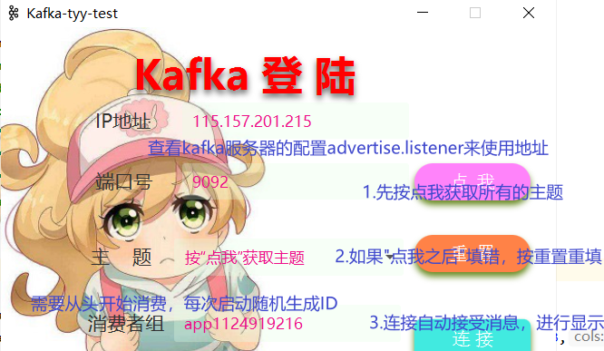
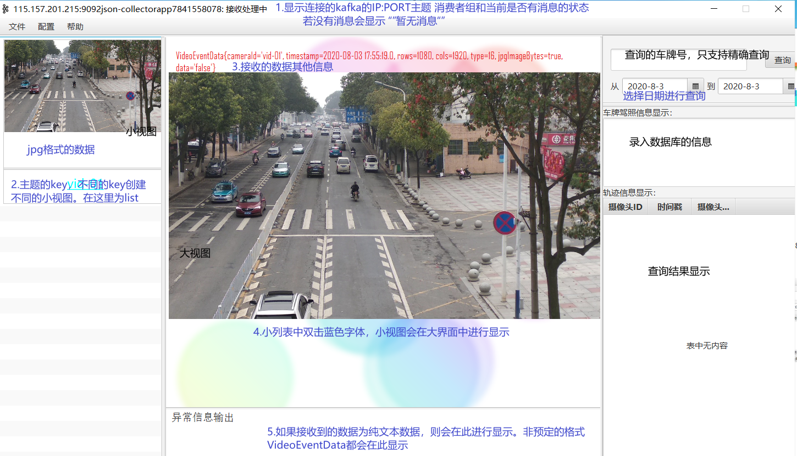
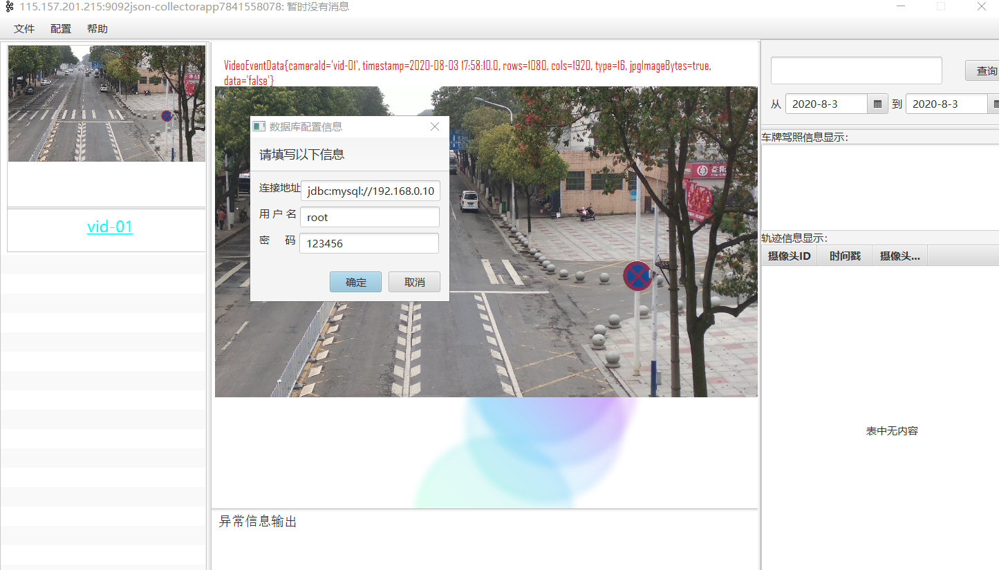
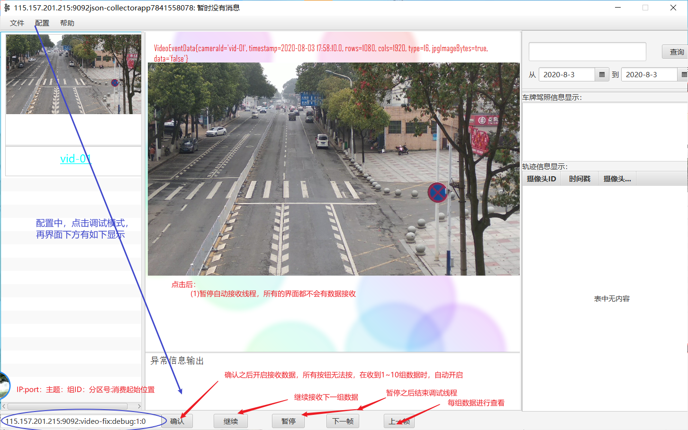
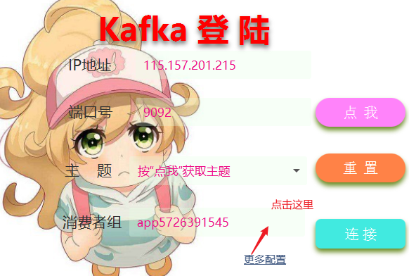
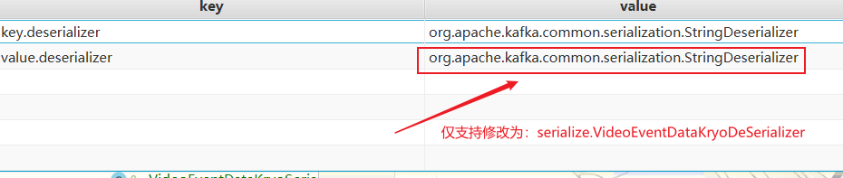

# 界面

## 登录连接kafka




## 主要数据显示界面

### 界面全局视图



### 数据库的连接配置

`配置->数据库配置信息`



### 调试模式

接收指定主题，分区的，位置的信息。



# 实现

## 基础解析数据格式：

###  目前默认支持的的数据格式为：

​	（1）JsonObject(rows cols type data)-----kafka---->stringserialize(JsonObject(VideoEventData))

（2）VideoEventdata(row,cols,type,data) --kafka->kryoserialize(JsonObject(VideoEventData))

```java
public class VideoEventData  implements Serializable {
   @Setter @Getter
   private String cameraId;
   @Setter @Getter
   private Timestamp timestamp;
   @Setter @Getter
   private int rows;
   @Setter @Getter
   private int cols;
   @Setter @Getter
   private int type;
   @Setter @Getter
   private byte[] jpgImageBytes = null;//保存只有jpg格式的数据。已经经过imencode编码
   @Setter  @Getter(value =  AccessLevel.PRIVATE)
   private String data;//原始的data数据存储为string格式。保存在内部
   public String toJson(){
      Gson gson = new Gson();
      String json = gson.toJson(this);
      return  json;
   }
   public VideoEventData fromJson(String data){
      Gson gson = new Gson();
      VideoEventData p = gson.fromJson(data, VideoEventData.class);
      return p;
   }

}
```

###  服务器上KryoCollector存储的数据：

​	1. 传输的是VideoEventData结构，图象保存再jpgImageBytes中，并且jpgImagebytes保存的是经过imencode编码的数据

```java
//图片数据
	MatOfByte buf = new MatOfByte();
			imencode(".jpg",smallframe,buf);
			byte[] data = buf.toArray();		
//发送的数据value
		VideoEventData obj = new VideoEventData();
		obj.setCameraId(cameraId);
		obj.setCols(cols);
		obj.setRows(rows);
		obj.setCols(type);
		obj.setTimestamp(new                     Timestamp(System.currentTimeMillis()));
			obj.setJpgImageBytes(data);
```

### 服务器上存储的collector-1920-1080：

Json封装的数据，对象的类为JsonObject,其中所有的图片json数据分为两种其数据都直接保存再data中，并且使用base.64进行封装：

​	   **(1) jpgImageBytes中存储的是经过imencode编码的数据**

```java
MatOfByte buf = new MatOfByte();
			imencode(".jpg",smallframe,buf);
			byte[] data = buf.toArray();
JsonObject obj = new JsonObject();
obj.addProperty("cameraId", cameraId);
obj.addProperty("timestamp", timestamp);
obj.addProperty("rows", rows);
obj.addProperty("cols", cols);
obj.addProperty("type", type);
obj.addProperty("data", Base64.getEncoder().encodeToString(data));
```

​			**（2）封装的数据像素数组 **

```java
smallframe.get(0,0,data)
JsonObject obj = new JsonObject();
			obj.addProperty("cameraId", cameraId);
			obj.addProperty("timestamp", timestamp);
			obj.addProperty("rows", rows);
			obj.addProperty("cols", cols);
			obj.addProperty("type", type);
			obj.addProperty("data", Base64.getEncoder().encodeToString(data));
			String json = gson.toJson(obj);
```

### 不同类型的数据解析

2.1.2 - 2.1.3 所示一共由3种数据格式,所以进行解析的时候需要注意：

	> 数据种jpgImageBytes与data只能存在一个，否则会导致数据格式错误。

所以对于数据的解析格式

```java
public byte[] getImagebytes() {
		if(this.getData() == null){
			return  jpgImageBytes;
		}
		byte[] pic = Base64.getDecoder().decode(this.getData());
		System.out.println(pic.length);
		if(pic.length >= this.getRows()*this.getCols() * 3) {

			Mat frame = new Mat(this.getRows(), this.getCols(), this.getType());
			frame.put(0, 0, pic);
			MatOfByte mob = new MatOfByte();
			Imgcodecs.imencode(".jpg", frame, mob);
			return mob.toArray();
		}else {
			return  pic;
		}
}
```


### 可配置支持的格式


VideoEventData---kafka-> VideoEventDataKryoDeSerializer(VideoEventData)

配置的界面设置：即可内部代码会把properties进行自动替换，并且执行不同的消费者程序

​	

### 数据解析关键代码

（1）解析的数据要求是Json格式,如果收到的数据没有key则直接显示在异常显示区。否则以json格式数据解析。*sample/rootlayout/model/KafkaMsg.java（67）*

```java
if(income._1 == null){//key值为null
            VideoShowPageData.ImageorOtherInfo.add(new Date() + ": (null" +"," + income._2 + ")\n");
            return;
        }
 VideoEventData ed = null;
        try {
             ed =  VideoEventData.fromJson(income._2);
        }catch (JsonSyntaxException e){
            VideoShowPageData.ImageorOtherInfo.add(new Date() + ": (null" +"," + income._2 + ")\n");
        }

```


（2）显示的图片数据格式必须是jpg格式

```java
ed.getImagebytes()
```


​

## 问题与修缮

- [ ] 增加缓冲区解决接收速度缓慢，播放不流畅的问题

- [ ] 需要了解consumer的原理以及kafka后台线程的作用

- [ ] 增加调试信息显示窗口，即log内的信息输出位置定制（为了易于定位错误，及时显示）

- [ ] BUG:fromJson阻塞的问题 【暂时为遇到，可能不需要解决】

- [ ] 对于清晰图像的大图显示过小的问题 【更改layout】

- [ ] 对kafka序列化格式的兼容问题 （如果没有封装成Json，是否还能正常解析？）

- [ ] 对于高清图的卡顿问题【感觉一下子 跳跃了10张图片】

     可能因素1：数据接收太快，处理解析速度太慢

  ​    可能因素2：数据太大，接收缓慢，出现内存覆盖

  # YOLO后台数据处理

  ## kafka数据的存储与读取


​
